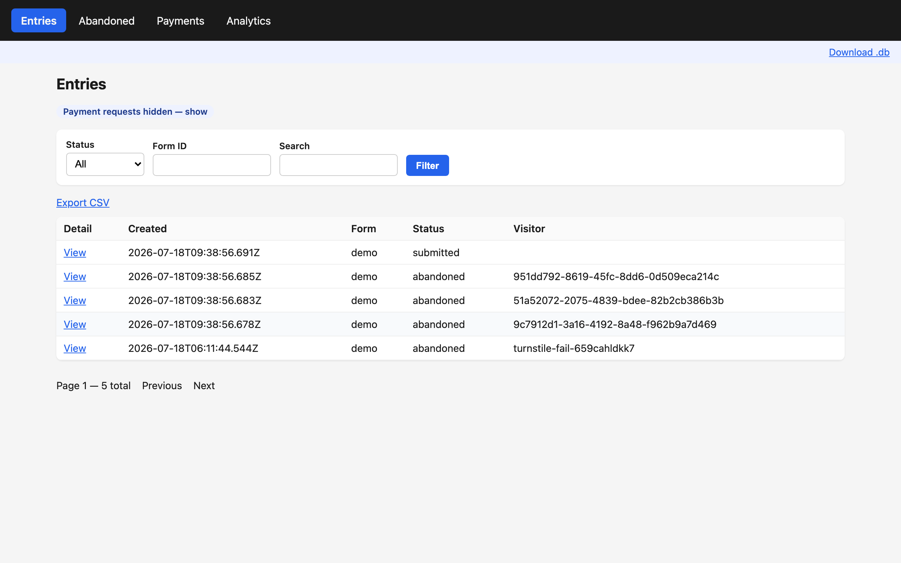
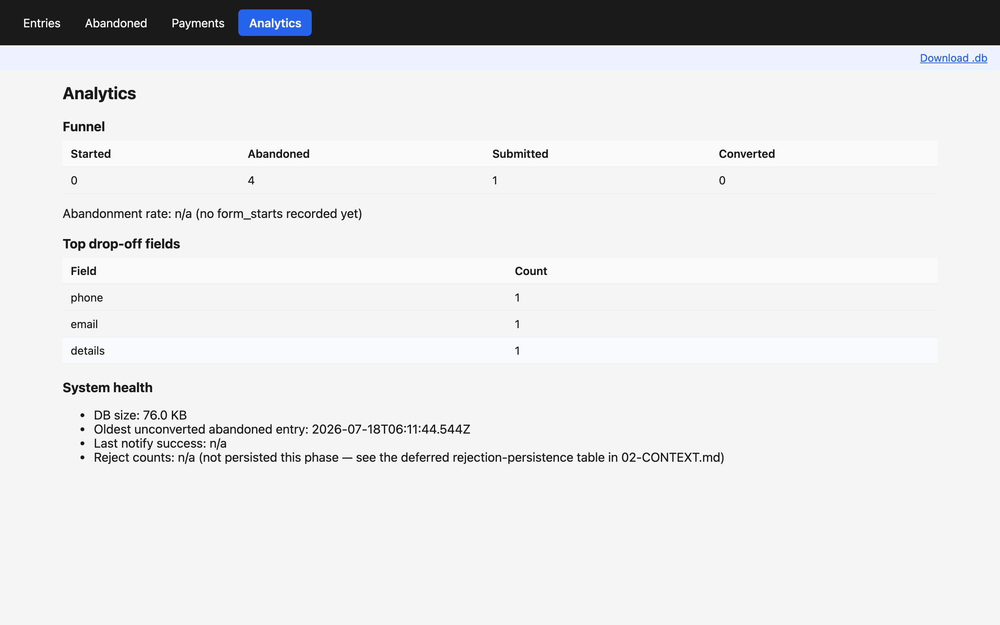
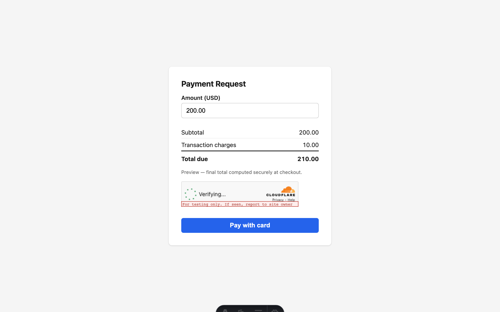

# cool-astro-forms

Form-abandonment capture for Astro, plus the lead-operations layer around it. When a visitor types into your form and leaves without submitting, the lead is saved: recover, convert, and manage it from one self-hosted form backend with **zero external dependencies by default**, just a SQLite file and your existing SMTP env vars. 1,094 unit tests and a Playwright e2e suite cover it.

[](./LICENSE)



`cool-astro-forms` instruments the Astro forms you already have; it is not a form builder. It rebuilds the lead-capture layer WordPress sites assemble from premium form plugins and their paid addons as one MIT Astro integration for server-output sites, covering 5 stages:

- **Capture:** form-abandonment capture, per-visitor journey tracking, and IP geolocation on every saved entry
- **Recover:** a save-confirmed "progress saved" toast plus one automated follow-up email per abandoned lead
- **Convert:** quote-first Stripe and PayPal payments, plus shareable `/forms-pay` payment links
- **Manage:** the `/forms-admin` UI (entries, abandoned leads, payments, analytics funnel, CSV + `.db` export)
- **Integrate:** Google Drive uploads, signed outbound webhooks, and Cloudflare Turnstile spam control

No other open-source package offers abandonment capture for Astro or static sites. The other 4 stages ship alongside it so a captured lead has somewhere to go.

## Quickstart

Every step below is executed end-to-end by [`scripts/verify-quickstart.mjs`](./scripts/verify-quickstart.mjs): a real `npm pack` tarball installed into a scratch Astro project, built, served, and hit with a real abandon POST that lands a row in SQLite. If this section and that script ever disagree, the script is right.

### 1. Install

```bash
npm install cool-astro-forms @astrojs/node
```

Optional scaffold first — `init` writes a full `.env.example` (every optional env var this package reads) and appends `data/` to `.gitignore`:

```bash
npx cool-astro-forms init
```

`astro add cool-astro-forms` also works, but it inserts a **bare** `coolForms()` call that fails validation on your next `astro dev`/`astro build` — `siteId`, `siteUrl`, and each form's `notifyTo` are required, with no defaults. Replace the bare call with the snippet below.

### 2. Configure `astro.config.mjs`

Every field shown here is required:

```js
import { defineConfig } from 'astro/config';
import node from '@astrojs/node';
import coolForms from 'cool-astro-forms';

export default defineConfig({
  output: 'server',
  adapter: node({ mode: 'standalone' }),
  integrations: [
    coolForms({
      siteId: 'my-site',
      siteUrl: 'http://localhost:4321', // must match the origin you actually serve on — swap for your real domain once deployed
      forms: {
        contact: { notifyTo: 'owner@example.com' },
      },
    }),
  ],
});
```

> **Deploying behind a proxy?** Most production Node hosts (Hostinger, Passenger/LiteSpeed, most PaaS) terminate TLS before your Node process, so Astro sees a plain-HTTP socket. Astro only trusts the proxy's `X-Forwarded-Proto` header when `security.allowedDomains` is set (Astro 5.14.2+). Without it, every urlencoded form POST to a server route fails with `403 Cross-site POST form submissions are forbidden`, and the first place you will meet that is the `/forms-admin` login form. Add your real domain to the config once you deploy:
>
> ```js
> security: {
>   allowedDomains: [{ hostname: 'example.com', protocol: 'https' }],
> },
> ```
>
> Abandonment capture keeps working either way (it posts JSON, which Astro's CSRF check ignores); the break hits admin login and payment form posts.

### 3. Tag a form

Add a `data-caf="<formId>"` attribute — no other markup changes are needed:

```html
<form data-caf="contact" method="post" action="/api/contact">
  <input type="text" name="name" />
  <input type="email" name="email" />
  <button type="submit">Send</button>
</form>
```

### 4. Build and run

```bash
npm run build
node dist/server/entry.mjs
```

The capture route is auto-injected at `/api/forms/abandon`. A visitor who types into that form and leaves lands a row in `data/forms.db` and a notification email at `notifyTo`. That is the entire adoption contract — one `coolForms()` call, one attribute. Payments, Drive uploads, lead recovery, and the admin UI stay completely inert until you opt in.

## How it works

1. The injected client script stages fields as the visitor types. Passwords, `data-caf-ignore` fields, and card/CSRF-shaped names are never staged.
2. Any of the 4 capture triggers POSTs the staged fields to `/api/forms/abandon`.
3. The server gates the save (origin check, rate limit, honeypot, email-or-phone requirement), dedupes repeat abandons within a 60-minute window, and writes one SQLite row with the journey trail and geolocation attached.
4. You get a notification email; the visitor sees a save-confirmed toast, and lead recovery (opt-in) sends one follow-up email with a link to finish.

   

5. A visitor who returns and submits converts: `recordSubmission()` marks the entry converted and stitches the full journey onto it.
6. `/forms-admin/analytics` turns `form_started` pings and captures into a funnel with abandonment rate and top drop-off fields.

   

7. Payments close the loop: create a quote from any entry, or share `/forms-pay?amount=200`. The server recomputes every total, and only a verified provider webhook marks a payment paid.

   

Every trigger, gate, and fallback in detail, with screenshots: [docs/how-it-works.md](./docs/how-it-works.md).

## Features

| Feature | Detail |
|---|---|
| Abandonment capture | 4 triggers: exit-intent, external-link click, `beforeunload`, tab-hidden; dedupe window; per-form overrides |
| User-journey tracking | Per-visitor page trail, shown on each entry's timeline |
| IP geolocation | Every saved entry enriched (`GEO_PROVIDER` override supported); a failed lookup never blocks the save |
| `/forms-admin` UI | Entries, abandoned, payments, analytics funnel, CSV + `.db` export; server-rendered, password-protected |
| Payments | Quote-first Stripe Checkout + PayPal; shareable `/forms-pay?amount=` links; server-computed fees; inbound webhooks as the sole payment truth |
| Spam control | Cloudflare Turnstile (soft-fail), honeypot, rate limiting |
| File uploads | Google Drive via raw REST (no SDK); Drive failures fall back to email attachment, the entry always saves, and oversized files are flagged |
| Lead recovery | One automated follow-up email per visitor, one-click unsubscribe honored forever |
| Outbound webhooks | Signed (`X-Caf-Signature`): `entry.submitted`, `entry.abandoned`, `payment.paid` |
| GDPR mechanics | `retentionDays` purge, `purgeVisitor()` erasure, `requireConsent` gating |
| Storage | SQLite file by default; optional Turso/libSQL for serverless hosts ([docs/serverless.md](./docs/serverless.md)) |

## Leaving WordPress? A premium form plugin alternative for Astro

WordPress sites pay for form-abandonment capture; Astro and static sites have had no open-source equivalent. That gap is why this package exists. It is an independent, clean-room implementation, not affiliated with or endorsed by any commercial form-plugin vendor (see [NOTICE](./NOTICE)). The table maps the premium form plugin features you lose leaving WordPress to what this provides:

| Capability | WordPress forms stack (Pro + addons) | Hosted form SaaS | Self-hosted OSS form backends | cool-astro-forms |
|---|---|---|---|---|
| Abandonment / partial-entry capture | Paid addon | Not offered | Not offered | Built in |
| Automated lead-recovery emails | Via automation addons | Not offered | Not offered | Built in |
| Stripe / PayPal quote payments | Paid addons | Varies by plan | Not offered | Built in |
| Admin UI + analytics | WordPress admin | Their dashboard | Minimal or none | `/forms-admin` |
| Where your data lives | Your WP database | Their servers | Your infrastructure | Your SQLite file |
| Cost | Annual per-site license | Monthly plan | Free | Free, MIT |

One deliberate trade-off: this package captures and manages form data, but it doesn't generate form markup. Bring your own form; a drag-and-drop builder is the one WordPress feature it won't replace.

## Docs

- [`docs/how-it-works.md`](./docs/how-it-works.md) — the full lifecycle walkthrough with screenshots: capture triggers, the server gate, admin views, analytics, recovery, payments, storage
- [`docs/payments.md`](./docs/payments.md) — Stripe/PayPal setup, the `/forms-pay` contract, fee caveats, webhook receiver recipes
- [`docs/drive.md`](./docs/drive.md) — Google Drive uploads: one-time consent, the 7-day token-expiry pitfall, the fallback contract
- [`docs/recovery.md`](./docs/recovery.md) — lead-recovery emails: consent modes, per-form scoping, unsubscribe mechanics
- [`docs/serverless.md`](./docs/serverless.md) — Turso/libSQL storage, explicit secrets, cold-start-safe rate limiting
- [`docs/gdpr.md`](./docs/gdpr.md) — each retention, erasure, and consent mechanic mapped to the GDPR concept it serves

## FAQ

### How do I capture abandoned form entries on an Astro site?
Tag the form with `data-caf` and configure `coolForms()`. The injected client script stages typed values and POSTs them to `/api/forms/abandon` when any of the 4 capture triggers fires. The entry lands in SQLite with the visitor's journey trail and geolocation attached.

### What is a self-hosted alternative to premium WordPress form plugins for Astro or static sites?
This package: it rebuilds the Pro-tier lead-capture layer of commercial WordPress form plugins (abandonment capture, payments, uploads, recovery emails, admin UI) as one MIT Astro integration with no per-site license and no hosted service.

### How can I track partial form submissions without WordPress?
Every abandoned entry stores the fields typed so far, the last-edited field, and a `form_started` ping. `/forms-admin/analytics` turns those into a captured→converted funnel with abandonment rate and top drop-off fields.

### How do I add Stripe or PayPal quote payments to an Astro contact form?
Create a pay-link from any entry in the admin, or share `/forms-pay?amount=200` with no entry at all. The server recomputes every total, and payments are marked paid only by verified Stripe or PayPal webhooks ([docs/payments.md](./docs/payments.md)).

### Is there an open-source form backend with an admin UI for Astro?
Yes — `/forms-admin` ships in this package: entries, abandoned leads, payments, analytics, CSV and `.db` export, enabled by a single `FORMS_ADMIN_PASSWORD` env var. Server-rendered, no client framework.

### How do I add file uploads to an Astro form without a SaaS?
Uploads land in your own Google Drive over raw REST (no SDK dependency). If Drive fails, files up to ~10MB fall back to email attachment; larger files are flagged and the entry still saves ([docs/drive.md](./docs/drive.md)).

## Contributing

Test and build commands, the clean-room statement, and the blocking pre-publish checklist (including a required security audit) live in [CONTRIBUTING.md](./CONTRIBUTING.md).

## License

MIT — see [LICENSE](./LICENSE).
