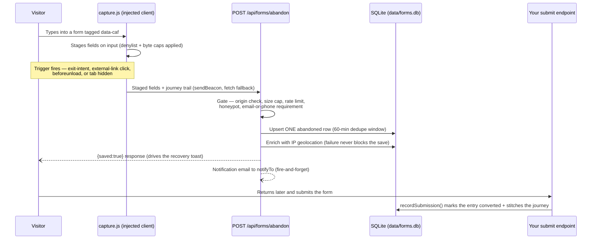
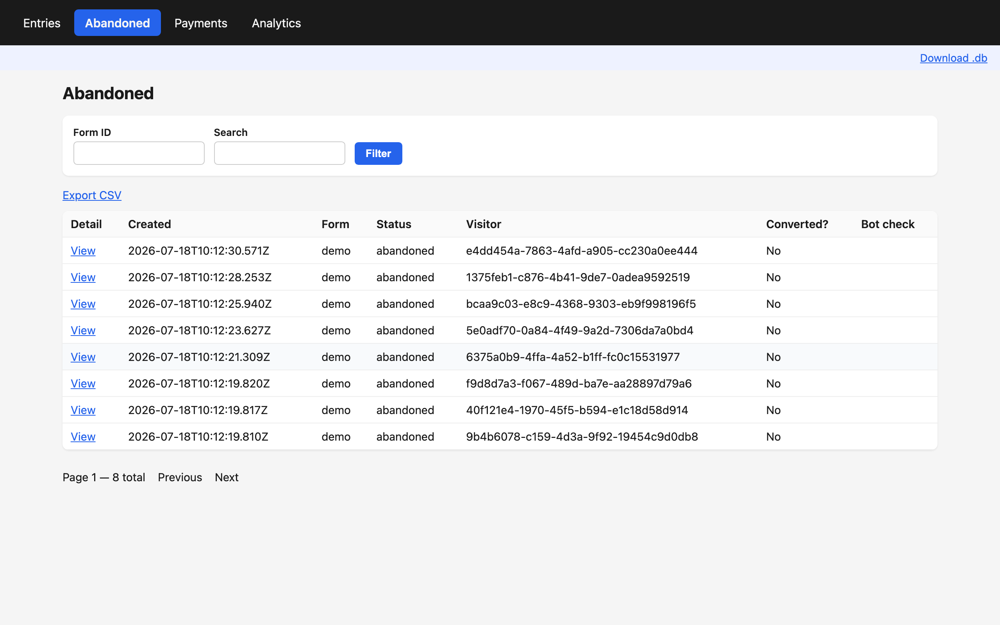
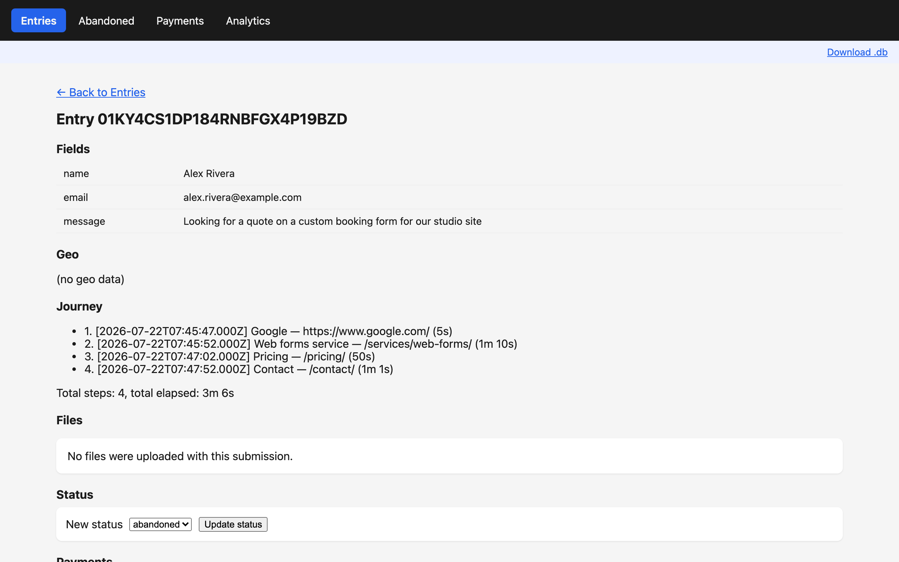

# How cool-astro-forms works

One lifecycle runs through the whole package: a visitor types into a form you tagged with `data-caf`, the injected client stages every keystroke's field state, an abandon trigger POSTs the staged fields to `/api/forms/abandon`, the server gates and saves them as one SQLite row enriched with the visitor's journey and geolocation, recovery (opt-in) sends exactly one follow-up email, and a returning visitor's real submission converts the same row instead of creating a duplicate. `/forms-admin` reads it all back as entries, abandoned leads, payments, and a funnel. This document walks that lifecycle end to end; every claim below describes shipped, tested behavior.

## The capture loop at a glance

## 1. Capture — triggers, staging, and the server gate

The client stages field values as the visitor types (`input`/`change` events) and never stages 3 categories: password inputs, anything marked `data-caf-ignore`, and fields whose names match `csrf|token|card|cvv|ssn`. Each field is capped in bytes, and the whole payload is capped at 64KB — an oversized payload degrades to a minimal payload rather than failing.

**4 triggers fire an abandon send**, each named in the client source:

1. **Exit-intent** — the pointer leaves the top of the viewport
2. **Leaving-link** — a click on a link that navigates away from the page
3. **`beforeunload`** — the tab or window closes
4. **`visibilitychange` → hidden** — the tab is backgrounded (the mobile-realistic trigger)

Transport is `sendBeacon` with a `fetch` keepalive fallback, throttled to one send per 10 seconds. When lead recovery is active, transport switches to a `fetch` that reads the response body — see §5.

The server-side gate at `/api/forms/abandon` runs a fixed pipeline; a request is saved only after passing every step:

1. **Origin check** — the full `URL.origin` is compared against `siteUrl`; a mismatched `Origin` header is hard-rejected, and `Referer` is consulted only when `Origin` is absent.
2. **Size cap** — a `Content-Length` precheck plus a capped, streaming body read.
3. **Rate limit** — a token-bucket limiter (in-memory by default; storage-backed on serverless, see §9).
4. **Honeypot** — a filled `_caf_hp` field returns `204` and saves nothing; the bot sees success.
5. **Schema parse** — a strict schema rejects malformed payloads.
6. **Capture requirement** — `abandonment.require: 'email-or-phone'` (the default) saves only when the typed fields include an email or phone number; `'always'` saves any typed input.
7. **Visitor identity** — the `_caf_uid` cookie is authoritative, never a client-supplied body value.
8. **Journey recompute** — the server sanitizes timestamps, re-applies the caps, and computes per-step durations; the client's journey claim is never trusted verbatim.

After the gate, the save is an **atomic upsert**: repeat abandons by the same visitor on the same form within the dedupe window (`dedupeWindowMins`, default 60) update one row instead of stacking duplicates, and an abandon for an already-converted entry is a no-op. Geolocation runs next and never blocks (§2). Cloudflare Turnstile, when configured, verifies **soft-fail**: a failed check flags the entry (the "Bot check" column in the admin) instead of discarding a possibly-real lead. Finally the notification email to `notifyTo` fires-and-forgets — create-only, unless the form sets `notifyOnUpdate`. The response is `{saved, reason}`, and every reject branch emits one structured JSON log line.

## 2. Journey and geolocation enrichment

Every entry carries the visitor's path to the form. The client keeps a `localStorage` trail of `{url, title, ts}` page views, seeded with the external referrer, deduplicating consecutive repeats, and capped at 100 steps / 10KB / 1 year — enforced on both client and server. Query strings are stripped by default (`journeyParams: false`), so a search term or magic-link token in a URL never lands in your database unless you opt in.

Geolocation happens once, server-side, at save time: an IP lookup (ipwhois.io by default, any provider via a URL-template config) with a 3-second timeout. Private and local IPs are skipped without a network call, and a failed or slow lookup leaves the `geo` field empty — **a geolocation failure never costs you the lead**.

## 3. The admin — `/forms-admin`

One env var (`FORMS_ADMIN_PASSWORD`) enables the whole admin. It is server-rendered with zero client-side framework, and sessions are HMAC-signed cookies with a 7-day TTL.

**Entries** is the master list: status/form/search filters, CSV export, and a `Download .db` snapshot link. Standalone payment-request rows are hidden behind a "Payment requests hidden — show" chip so they never pollute the lead list.

**Abandoned** narrows to captured leads and adds 2 columns the Entries view lacks: **Converted?** (did this visitor later submit) and **Bot check** (the Turnstile soft-fail flag from §1).

**Entry detail** shows everything one lead produced: the captured fields (HTML-escaped, always), the geo result, the journey timeline with per-step and total durations, any uploaded files with their Drive links, manual status controls, and the quote-flow — "Create payment link" turns this entry into a Stripe or PayPal payment request (§6).

Two exports, two scopes: **CSV** dumps the current filter in full (pagination stripped, formula-injection-escaped) on every storage backend; the **`.db` download** is a `better-sqlite3` backup snapshot and is SQLite-only — on Turso it returns a clean `501`, never a stale file.

## 4. Reports — the analytics funnel

The funnel is fed by `form_started` pings: the client sends exactly one ping per visitor per form (a memory flag plus a `localStorage` guard prevent repeats) to an idempotent `/api/forms/started` route, landing one unique row per site+visitor+form. That "Started" count is the funnel's denominator; "Abandoned", "Submitted", and "Converted" come from entry statuses. The screenshot above shows a playground run: **12 started, 8 abandoned, 1 submitted — a 66.7% abandonment rate**.

**Top drop-off fields** ranks the last-edited field across abandoned entries — in the run above, `email` (6), `phone` (1), and `details` (1) — which tells you *where* in the form people quit, not just that they did. **System health** underneath reports DB size, the oldest unconverted abandoned entry, and the last successful notification send. Synthetic `_payment_request` entries (§6) are unconditionally excluded from every funnel and drop-off query.

## 5. Recovery — the toast, the sweep, and one email ever

Recovery is off by default and activates on `recovery.enabled: true` alone. Once active, an abandoning visitor sees the toast above — *"Your progress is saved — we'll email you a link to finish."* — and the toast is honest by construction: the client's transport switches from fire-and-forget `sendBeacon` to a `fetch` that reads the server's `{saved:true}` response, and **no toast renders unless the server confirmed the save**.

The follow-up email is driven by a lazy sweep, not a cron job: on real request traffic, at most one pass per 15 minutes per process, the sweep claims up to 25 eligible rows — abandoned, consented, past `delayMins` (default 60), never sent, never suppressed — and sends **exactly one email per lead, ever**. The atomic claim happens *before* the send inside a `BEGIN IMMEDIATE` transaction, so racing sweeps or a process recycle can never double-email a visitor. A `setTimeout` schedule was rejected deliberately: process managers recycle idle workers and silently drop timers; request-driven sweeps only need what a live site already has.

Every follow-up carries a one-click, no-login unsubscribe link: an HMAC token over the visitor's UUID — never the email address, so a forwarded link discloses nothing. The route is idempotent, answers every invalid or forged token with the same generic message, and the opt-out is **honored forever**. The suppression record (UUID + timestamp, no personal data) deliberately survives `purgeVisitor()` GDPR erasure — deleting it would silently re-subscribe someone who said stop, since their UUID lives in their own browser, not your database. Full rationale: [gdpr.md](./gdpr.md); config, consent modes (`'auto'` vs `'checkbox'`), and per-form opt-outs: [recovery.md](./recovery.md).

## 6. Payments — quote-first, server-priced

Payments are env-gated and fully inert: with no Stripe or PayPal key configured, zero payment routes, pages, or UI exist. With a key, there are 2 ways to get paid:

1. **From an entry** — the admin quote-flow on any entry detail page takes an amount plus optional memo and creates a Stripe Payment Link or PayPal order, stored on the entry, shown with a copy button, and auto-emailed to the visitor.
2. **From nothing** — share `/forms-pay?amount=200`: a public payment-request page needing no pre-existing entry.

The page renders the base amount, configured fee lines, and total — and that render is **a preview only**. The server recomputes every total from the posted base amount and your `payLinkFees`/`feePresets` config; no total or fee field exists anywhere in the request for a client to tamper with. Amounts outside the configured min/max caps, or a currency outside the whitelist, are rejected with a clean `400`, never silently clamped. Turnstile gates the page when configured.

**Inbound webhooks are the sole source of payment truth.** No browser redirect, no success-page landing, and no admin action ever flips a payment to paid — only a signature-verified Stripe or PayPal webhook does, with raw-body-first verification and database-persisted idempotency. Standalone `/forms-pay` payments are recorded under a synthetic `_payment_request` entry, always visible in the Payments admin view. Full contract, fee-legality caveats, and receiver recipes: [payments.md](./payments.md).

## 7. File uploads — Google Drive with a guaranteed fallback

`recordSubmission()` is the only path that touches Drive: pass `files: FileInput[]` (real bytes) from your own submit endpoint, and each file comes back as exactly one of 3 outcomes — `driveLink` (uploaded, link it in your email), `fallbackBuffer` (Drive failed or is unconfigured and the file fits the ~10MB fallback cap — attach it yourself), or `fallbackTooLarge` (neither, but **the submission entry is still saved**). Every Drive failure mode — auth error, non-2xx, network throw, stalled connection, oversized file, missing config — degrades to a fallback outcome; a visitor's entry never disappears because Drive was down.

Uploads land in your own Drive under `/<rootFolderName>/<siteId>/<YYYY-MM>/<entryId>/<filename>`, via raw Drive v3 REST calls over `fetch` — zero SDK dependency — using only the non-sensitive `drive.file` scope. One setup pitfall bites a week late: a consent screen left in "Testing" status silently expires the refresh token after 7 days. Setup, the token CLI, and that pitfall: [drive.md](./drive.md).

## 8. Outbound webhooks — signed events out

Configure `webhooks[]` and this package POSTs signed, real-time events to your receivers for 3 event types: `entry.submitted`, `entry.abandoned`, and `payment.paid`. Every delivery carries an `X-Caf-Signature` header — `t=<unix-seconds>,v1=<hex HMAC-SHA256>` over `${t}.${rawBody}` — and the exported `verifyWebhookSignature()` helper validates it without ever throwing. Delivery is in-process and best-effort: up to 3 attempts with 1s/2s backoff, no durable queue, and payment correctness is never at stake because inbound provider webhooks (§6) remain the system of record. Receiver recipes for Slack, n8n, and Make: [payments.md](./payments.md#5-hook-01--outbound-webhooks).

## 9. Storage — SQLite by default, Turso for serverless

The default backend is a single SQLite file at `data/forms.db` — WAL mode, prepared statements, additive-only migrations, no external service. Everything the package writes (entries, payments, files, form starts, rate-limit buckets, suppressions) lands in that one file, and `retentionDays` (default 90) prunes abandoned-never-converted rows on an opportunistic sweep.

Serverless hosts get the same contract through **Turso/libSQL**: set `storage.kind: 'turso'`, install `@libsql/client`, and every adapter method — including the atomic claims recovery and payments depend on — behaves identically; there is no reduced "serverless mode". Two serverless-specific switches matter: `rateLimit.store: 'storage'` (so rate limiting survives cold starts) and `CAF_REQUIRE_EXPLICIT_SECRETS=1` (so a missing HMAC secret fails loud at boot instead of silently invalidating sessions and unsubscribe links). Both, with the reasoning: [serverless.md](./serverless.md).

## Run it yourself

Two proofs ship in this repo, and both run without any external account:

- **The playground** — `npm run dev -w apps/playground` with `FORMS_ADMIN_PASSWORD` set, then open `/forms-admin`. Every screenshot in this document comes from it. Dev-only debug seams (`/api/debug-entries`, `/api/debug-recovery?action=sweep`) let you reset state and run the real recovery sweep without waiting 60 minutes; both refuse to run outside a local dev build.
- **The quickstart proof** — `node scripts/verify-quickstart.mjs` packs the real tarball, installs it into a scratch Astro project, builds, serves, fires a real abandon POST, and asserts the row landed in SQLite. The README's Quickstart is a transcription of this script, not the other way around.
